<div align="center">

# 🚀 AI-Powered Skill Development Roadmap Generator

[](https://www.djangoproject.com/)
[](https://www.python.org/)
[](https://www.docker.com/)
[](https://huggingface.co/)

### *An intelligent AI-powered platform for personalized learning roadmaps using RAG, Vector Databases, and Large Language Models*

[🌐 Live Demo](https://rmpai.pythonanywhere.com/) • [📧 Contact](#-contact) • [⭐ Star this repo](https://github.com/Kowshik-bh18/AIML_Based_Roadmap_Generator_for_Skill_Development)

</div>

---

## 📋 Table of Contents

- [Overview](#-overview)
- [Key Features](#-key-features)
- [System Architecture](#-system-architecture)
- [Technology Stack](#-technology-stack)
- [Screenshots](#-screenshots)
- [Installation Guide](#-installation-guide)
- [Usage](#-usage)
- [Project Structure](#-project-structure)
- [Contributing](#-contributing)
- [Acknowledgments](#-acknowledgments)
- [Contact](#-contact)

---

## 🎯 Overview

The **AI-Powered Skill Development Roadmap Generator** is an intelligent learning platform designed for students, professionals, and lifelong learners. It leverages cutting-edge AI technologies including Retrieval Augmented Generation (RAG), Vector Databases, and Large Language Models to create personalized, context-aware learning pathways.

### 💡 What Makes This Special?

- **🧠 RAG-Powered Intelligence**: Context-aware responses using advanced retrieval techniques
- **📚 NotebookLM-Style Assistant**: Analyze and chat with your documents and study materials
- **🎯 Personalized Roadmaps**: Day-wise structured learning paths tailored to your goals
- **🔒 Secure & Scalable**: Production-ready with authentication, subscriptions, and admin workflows
- **🐳 Containerized**: Docker-based vector database for consistent deployment

> **Note**: The live demo requires an active AI endpoint. If unresponsive, please contact me to activate it.

---

## ✨ Key Features

### 🤖 AI-Powered Learning

| Feature | Description |
|---------|-------------|
| **Smart Roadmap Generation** | Personalized skill roadmaps with structured day-wise guidance using LLMs |
| **RAG Pipeline** | Context-aware responses through Retrieval Augmented Generation |
| **Vector Search** | Semantic search using Endee Vector Database (Docker-based) with persistent storage |
| **Document Intelligence** | NotebookLM-style AI assistant for analyzing PDFs, notes, and study materials |
| **Flexible LLM Integration** | Support for local (Mistral via Ollama) and remote LLM endpoints |
| **Semantic Embeddings** | Advanced understanding using Sentence Transformers |

### 👥 User Management

- ✅ Secure authentication (Login/Register/Guest mode)
- 💎 Premium subscription workflow with admin approval
- 📧 Automated email notifications for:
  - Successful registration
  - Subscription status updates
  - Admin alerts for new requests
- 🎯 Usage limits for free tier users

### 💬 Intelligent Chat System

- 🧠 Persistent conversation memory
- 📊 RAG-powered roadmap generation chatbot
- 📄 Document upload with contextual AI assistance
- 📤 Export capabilities:
  - PDF
  - JSON
  - TXT
  - PPTX

### 🛡️ Admin Dashboard

- ⚡ Subscription approval/rejection workflow
- 📊 User activity monitoring
- 📧 Automated notification system
- 📈 Analytics and insights

### 🎨 Modern UI/UX

- 📱 Fully responsive Bootstrap design
- ✨ Smooth animations and transitions
- 🌙 Dark mode support
- 🎯 Intuitive dashboard layout

---

## 🏗️ System Architecture

### High-Level Architecture

```
┌─────────────────────────────────────────────────────────────────┐
│                         User Interface                          │
│                  (Bootstrap + Django Templates)                 │
└────────────────┬────────────────────────────────────────────────┘
                 │
                 ▼
┌─────────────────────────────────────────────────────────────────┐
│                      Django Backend                             │
│  ┌──────────────┐  ┌──────────────┐  ┌──────────────┐         │
│  │   Auth &     │  │   Premium    │  │   Admin      │         │
│  │   Users      │  │   System     │  │   Dashboard  │         │
│  └──────────────┘  └──────────────┘  └──────────────┘         │
└────────────────┬────────────────────────────────────────────────┘
                 │
                 ▼
┌─────────────────────────────────────────────────────────────────┐
│                        AI Processing Layer                      │
│  ┌──────────────────────────────────────────────────────────┐  │
│  │              RAG Pipeline Controller                     │  │
│  └──────────────────────────────────────────────────────────┘  │
│           │                    │                    │           │
│           ▼                    ▼                    ▼           │
│  ┌─────────────────┐  ┌─────────────────┐  ┌──────────────┐   │
│  │   Embedding     │  │  Vector Search  │  │  LLM Query   │   │
│  │   Generation    │  │    Engine       │  │  Processor   │   │
│  │  (Transformers) │  │  (Endee API)    │  │  (Mistral)   │   │
│  └─────────────────┘  └─────────────────┘  └──────────────┘   │
└─────────────────────────────────────────────────────────────────┘
                 │                    │
                 ▼                    ▼
┌──────────────────────────┐  ┌──────────────────────────┐
│   Endee Vector Database  │  │    LLM Service           │
│   (Docker Container)     │  │    (Ollama/API)          │
│   - Persistent Storage   │  │    - Mistral 7B          │
│   - Semantic Search      │  │    - Context Generation  │
│   - Port: 9090           │  │    - Response Creation   │
└──────────────────────────┘  └──────────────────────────┘
```

### RAG Workflow

```
┌──────────────┐
│ User Query   │
└──────┬───────┘
       │
       ▼
┌─────────────────────────────────────────────────────┐
│ Step 1: Query Embedding                             │
│ • Convert user question to vector representation    │
│ • Model: sentence-transformers/all-MiniLM-L6-v2     │
└──────┬──────────────────────────────────────────────┘
       │
       ▼
┌─────────────────────────────────────────────────────┐
│ Step 2: Vector Search                               │
│ • Search Endee Vector DB for similar embeddings     │
│ • Retrieve top-k most relevant chunks (k=5)         │
│ • Calculate cosine similarity scores                │
└──────┬──────────────────────────────────────────────┘
       │
       ▼
┌─────────────────────────────────────────────────────┐
│ Step 3: Context Retrieval                           │
│ • Extract relevant document chunks                  │
│ • Rank by relevance score                           │
│ • Prepare context window for LLM                    │
└──────┬──────────────────────────────────────────────┘
       │
       ▼
┌─────────────────────────────────────────────────────┐
│ Step 4: LLM Generation                              │
│ • Feed context + query to Mistral-7B                │
│ • Generate structured, accurate response            │
│ • Format as day-wise roadmap (if applicable)        │
└──────┬──────────────────────────────────────────────┘
       │
       ▼
┌──────────────┐
│ Final Answer │
└──────────────┘
```

### Data Flow Diagram

```
User Input → Preprocessing → Embedding Model
                                    ↓
                            Vector Database
                            (Semantic Search)
                                    ↓
                            Context Retrieval
                                    ↓
                Query + Context → LLM (Mistral)
                                    ↓
                            Response Generation
                                    ↓
                            Post-processing
                                    ↓
                            User Interface
```

---

## 🛠️ Technology Stack

### Backend

```
┌─────────────────────────────────────────┐
│  Framework:     Django 4.x              │
│  Language:      Python 3.10+            │
│  Architecture:  REST API + MVC          │
│  Database:      SQLite/PostgreSQL       │
│  Vector DB:     Endee (Docker)          │
└─────────────────────────────────────────┘
```

### AI/ML Components

| Component | Technology | Purpose |
|-----------|-----------|---------|
| **Embeddings** | Sentence Transformers | Convert text to vector representations |
| **Vector Database** | Endee (Docker) | Persistent semantic search storage |
| **LLM** | Mistral 7B (Ollama) | Natural language generation |
| **RAG Framework** | Custom Pipeline | Context-aware response generation |
| **Document Processing** | PyPDF, python-docx | Extract text from various formats |

### Frontend

- **Framework**: Bootstrap 5
- **Languages**: HTML5, CSS3, JavaScript
- **Design**: Responsive, Mobile-first
- **Animations**: Custom CSS transitions

### Infrastructure & DevOps

```yaml
Deployment:
  - Platform: PythonAnywhere
  - Web Server: WSGI (Gunicorn)
  - Static Files: WhiteNoise/CDN

Containerization:
  - Docker: Endee Vector Database
  - Volumes: Persistent data storage
  - Network: Bridge networking

AI Services:
  - Local: Ollama + Mistral
  - Remote: API endpoints (optional)
  - Ngrok: Endpoint exposure
```

---

## 📸 Screenshots

### 🔐 Authentication System
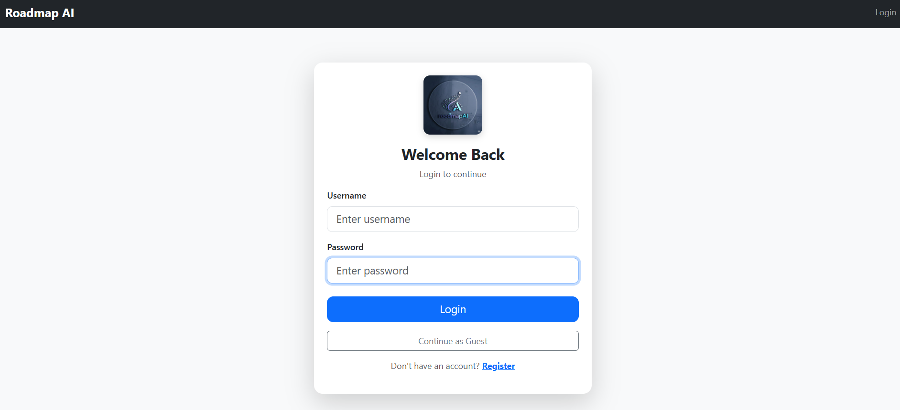
*Secure login interface with guest mode support*

### 💎 Subscription Workflow
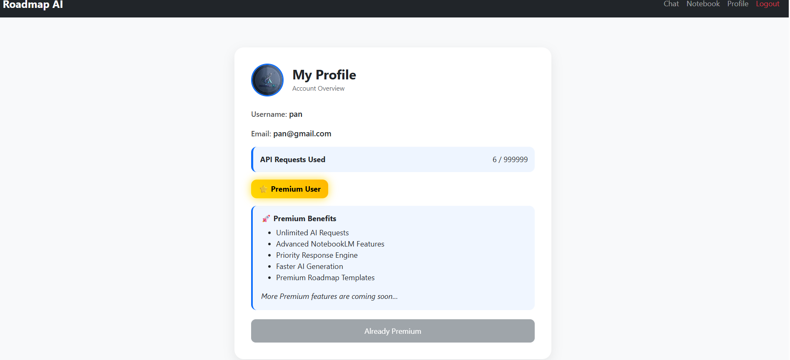
*Premium subscription request interface*

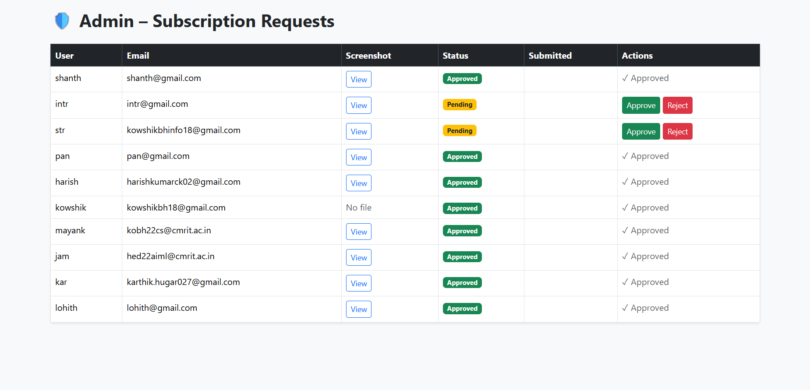
*Admin approval dashboard for managing subscriptions*

### 📧 Email Notifications
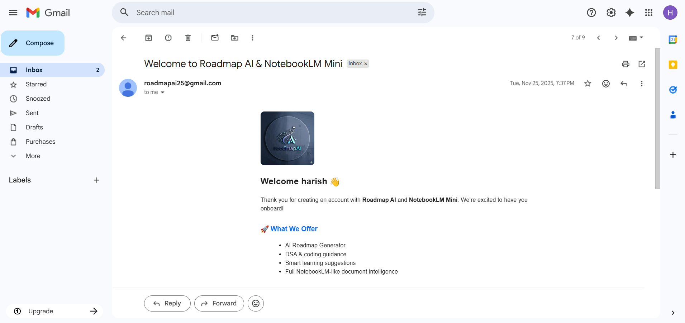
*Automated email notifications for users*

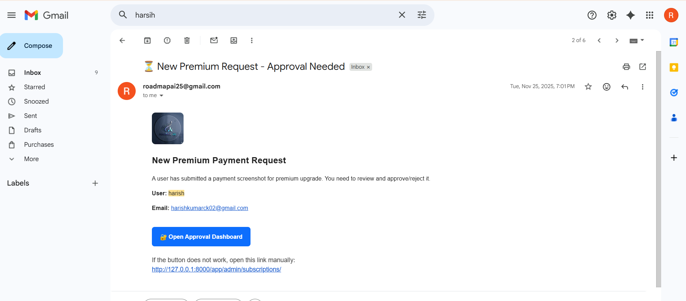
*Admin alert emails for new subscription requests*

### 🗄️ Vector Database
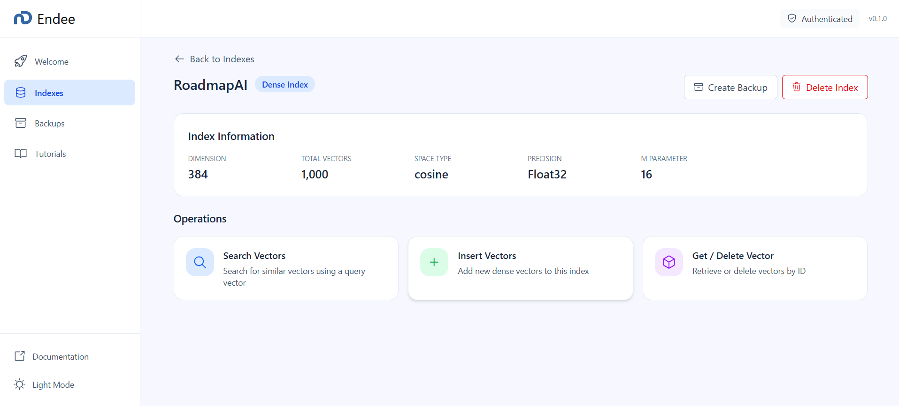
*Endee Vector Database management interface*

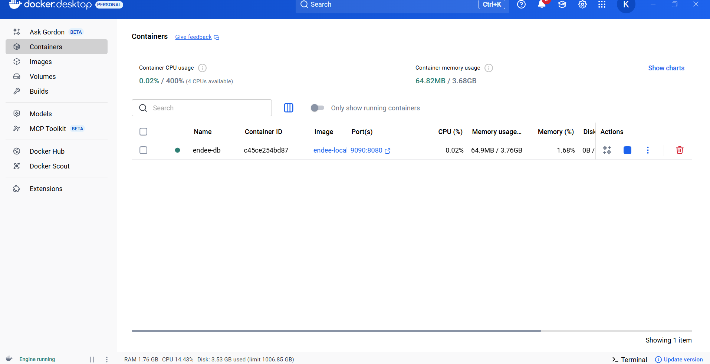
*Docker containerization of Endee Vector DB*

### 🤖 AI Features
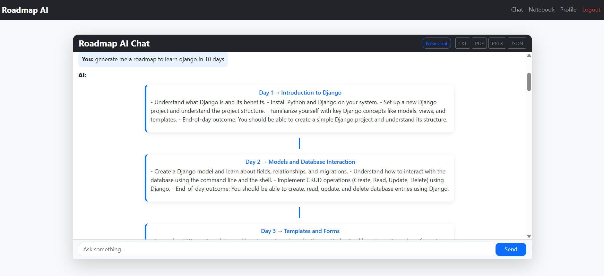
*Intelligent roadmap generation chatbot*

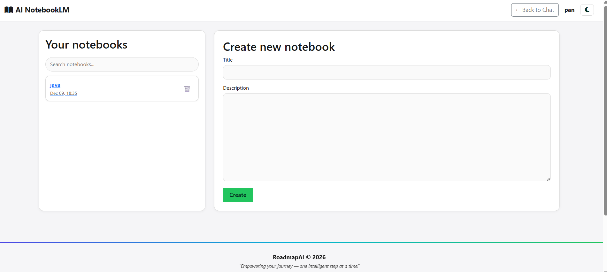
*Document analysis dashboard*

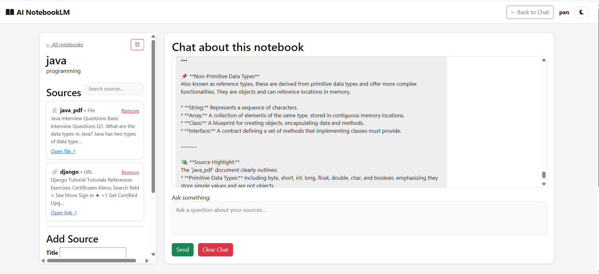
*AI-powered document assistant interface*

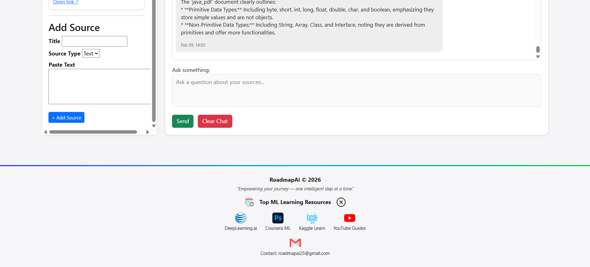
*Contextual Q&A with uploaded documents*

---

## 🚀 Installation Guide

### Prerequisites

Ensure you have the following installed:

- ✅ Python 3.10 or higher
- ✅ Git
- ✅ Docker Desktop
- ✅ Ollama (optional, for local LLM)
- ✅ 8GB+ RAM recommended

### Step 1️⃣: Clone Repository

```bash
git clone https://github.com/Kowshik-bh18/AIML_Based_Roadmap_Generator_for_Skill_Development.git
cd AIML_Based_Roadmap_Generator_for_Skill_Development
```

### Step 2️⃣: Set Up Python Environment

```bash
# Create virtual environment
python -m venv myenv

# Activate virtual environment
# On Windows:
myenv\Scripts\activate
# On macOS/Linux:
source myenv/bin/activate

# Install dependencies
pip install -r requirements.txt
```

### Step 3️⃣: Configure Django

```bash
# Run migrations
python manage.py makemigrations
python manage.py migrate

# Create superuser (optional)
python manage.py createsuperuser

# Collect static files
python manage.py collectstatic --noinput
```

### Step 4️⃣: Set Up Endee Vector Database

```bash
# Clone Endee repository
git clone https://github.com/endee-ai/endee.git
cd endee

# Build Docker image
docker build -t endee-local .

# Run container with persistent storage
docker run -d \
  --name endee-db \
  -p 9090:8080 \
  -v endee-data:/data \
  endee-local

# Verify container is running
docker ps

# Health check
curl http://localhost:9090/api/v1/health
# Expected: {"status":"ok"}
```

**Key Points:**
- Port `9090` maps to Endee's internal port `8080`
- Volume `endee-data` ensures data persists across container restarts
- API base URL: `http://localhost:9090/api/v1`

### Step 5️⃣: Install and Configure LLM (Local)

```bash
# Install Ollama (if not already installed)
# Visit: https://ollama.ai/download

# Pull Mistral model
ollama pull mistral

# Run Mistral
ollama run mistral
```

### Step 6️⃣: Configure Environment Variables

Create a `.env` file in the project root:

```env
# Django settings
SECRET_KEY=your-secret-key-here
DEBUG=True
ALLOWED_HOSTS=localhost,127.0.0.1

# Email configuration
EMAIL_HOST=smtp.gmail.com
EMAIL_PORT=587
EMAIL_USE_TLS=True
EMAIL_HOST_USER=your-email@gmail.com
EMAIL_HOST_PASSWORD=your-app-password

# Vector DB
ENDEE_API_URL=http://localhost:9090/api/v1

# LLM Configuration
LLM_ENDPOINT=http://localhost:11434/api/generate
LLM_MODEL=mistral
```

### Step 7️⃣: Run the Application

```bash
# Start Django development server
python manage.py runserver

# Access the application
# Open browser: http://127.0.0.1:8000
```

### Step 8️⃣: Verify Installation

**Checklist:**

- ✅ Django server running on port 8000
- ✅ Endee Docker container active (`docker ps`)
- ✅ LLM service accessible (Ollama running)
- ✅ Health check successful: `http://localhost:9090/api/v1/health`

**Test the RAG Pipeline:**

1. Register/login to the platform
2. Navigate to the roadmap generator
3. Ask a question (e.g., "Create a roadmap for learning Python")
4. Upload a document in NotebookLM feature
5. Verify AI responses are generated

### Troubleshooting

| Issue | Solution |
|-------|----------|
| Endee container not running | Run `docker start endee-db` |
| LLM not responding | Check Ollama service: `ollama list` |
| Django errors | Check logs: `python manage.py runserver --verbosity 3` |
| Port conflicts | Change port in settings or kill conflicting process |

---

## 💻 Usage

### For Students & Learners

1. **Create Account**: Register with email or use guest mode
2. **Generate Roadmap**: Ask the AI to create a learning path for any skill
3. **Upload Documents**: Add study materials for AI-powered assistance
4. **Track Progress**: Follow day-wise structured guidance
5. **Export**: Download roadmaps as PDF, JSON, or PPTX

### For Premium Users

1. **Request Subscription**: Submit premium access request
2. **Email Notification**: Receive status updates via email
3. **Unlimited Access**: No usage limits on AI queries
4. **Priority Support**: Faster response times
5. **Advanced Features**: Access to beta features

### For Administrators

1. **Access Admin Panel**: `/admin` endpoint
2. **Review Requests**: Approve/reject subscription requests
3. **Monitor Users**: Track activity and usage
4. **Manage Content**: Moderate generated content
5. **Email Notifications**: Automatic alerts for actions

---

## 📁 Project Structure

```
AIML_Based_Roadmap_Generator_for_Skill_Development/
│
├── 📂 ai_app/                     # Main application
│   ├── models.py                  # Database models
│   ├── views.py                   # View controllers
│   ├── urls.py                    # URL routing
│   ├── admin.py                   # Admin configurations
│   └── templates/                 # HTML templates
│
├── 📂 ai_notebook/                # NotebookLM feature
│   ├── document_processor.py     # PDF/DOCX parsing
│   ├── rag_pipeline.py            # RAG implementation
│   └── embeddings.py              # Vector generation
│
├── 📂 ai_roadmap_app/             # Django project settings
│   ├── settings.py                # Configuration
│   ├── urls.py                    # Root URL config
│   └── wsgi.py                    # WSGI application
│
├── 📂 notebook_files/             # Uploaded documents storage
│
├── 📂 static/                     # Static assets
│   ├── css/                       # Stylesheets
│   ├── js/                        # JavaScript files
│   └── images/                    # Images & icons
│
├── 📂 media/                      # User-generated content
│
├── 📂 screenshots/                # Documentation images
│
├── 📄 manage.py                   # Django management script
├── 📄 requirements.txt            # Python dependencies
├── 📄 test.py                     # Test suite
├── 📄 .env.example                # Environment template
└── 📄 README.md                   # This file
```

---

## 🤝 Contributing

Contributions are welcome! Follow these steps:

### How to Contribute

1. **Fork the Repository**
   ```bash
   git fork https://github.com/Kowshik-bh18/AIML_Based_Roadmap_Generator_for_Skill_Development.git
   ```

2. **Create a Feature Branch**
   ```bash
   git checkout -b feature/YourFeatureName
   ```

3. **Make Your Changes**
   - Write clean, documented code
   - Follow PEP 8 style guidelines
   - Add tests if applicable

4. **Commit Your Changes**
   ```bash
   git commit -m "Add: Description of your feature"
   ```

5. **Push to Your Fork**
   ```bash
   git push origin feature/YourFeatureName
   ```

6. **Open a Pull Request**
   - Provide a clear description
   - Reference any related issues
   - Wait for review

### Contribution Guidelines

- 📝 Follow existing code style
- ✅ Test your changes thoroughly
- 📚 Update documentation as needed
- 🐛 Report bugs via GitHub Issues
- 💡 Suggest features in Discussions

---

## 🙏 Acknowledgments

This project represents an evolution of my earlier AI roadmap generator work. I am grateful to my friends and collaborators who contributed during the initial development phases, particularly in:

- **Model Fine-tuning Experiments**: Testing and optimizing LLM performance
- **Data Collection**: Gathering training datasets and learning resources
- **Web Scraping**: Automating content acquisition for knowledge base
- **Feedback & Testing**: Providing valuable insights for improvements

The current version builds upon that foundation with significant enhancements:

✨ Advanced RAG architecture with vector databases  
✨ NotebookLM-style document intelligence  
✨ Production-ready authentication and subscription system  
✨ Improved scalability and deployment infrastructure  
✨ Enhanced UI/UX with modern design patterns

This journey has been a collaborative learning experience, and I'm grateful for all the support and encouragement received along the way.

---

## 👨‍💻 Contributors

<div align="center">
  <table>
    <tr>
      <td align="center">
        <a href="https://github.com/Kowshik-bh18">
          
          <br />
          <sub><b>Kowshik BH</b></sub>
        </a>
        <br />
        <sub>Lead Developer</sub>
      </td>
    </tr>
  </table>
</div>

---

## 📧 Contact

<div align="center">

### **Kowshik BH**

[](mailto:kowshikbh18@gmail.com)
[](https://www.linkedin.com/in/kowshikbh)
[](https://github.com/Kowshik-bh18)

</div>

---

## 📄 License

This project is licensed under the MIT License - see the [LICENSE](LICENSE) file for details.

---

<div align="center">

### ⭐ If you find this project helpful, please consider starring the repository!

**Made with ❤️ by [Kowshik BH](https://github.com/Kowshik-bh18)**

</div>
